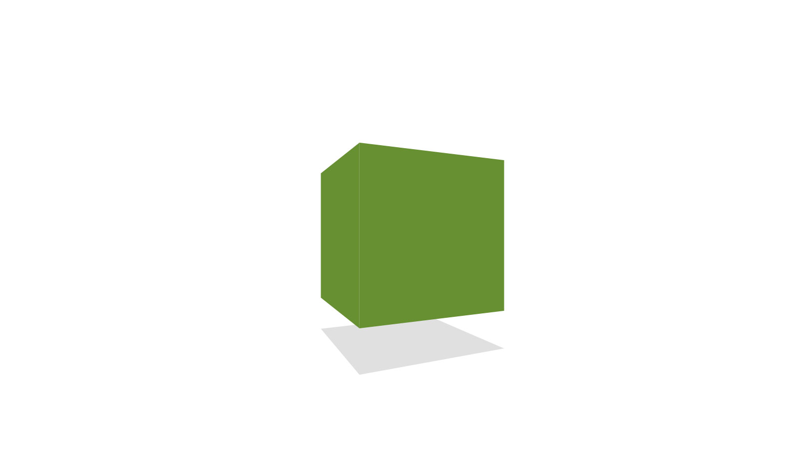

ds.threeHXCanvas
(DemoScene).threeHXCanvas
=============
<pre>
  __  __               __ ___  _______                     
 / /_/ /  _______ ___ / // / |/_/ ___/__ ____ _  _____ ____
/ __/ _ \/ __/ -_) -_) _  />  \/ /__/ _ `/ _ \ |/ / _ `(_- |
\__/_//_/_/  \__/\__/_//_/_/|_|\___/\_,_/_//_/___/\_,_/___/
                                                           
                                                                                                                                                                                     
</pre>

	

Simple threeJS canvas example redone in threeHX

